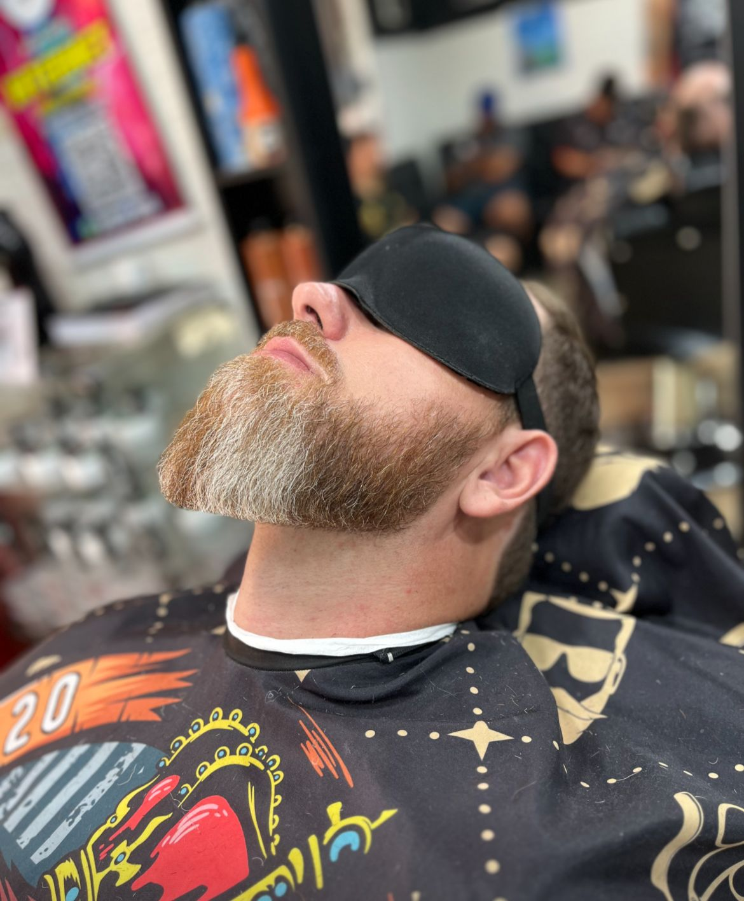

<h1 align="center">💈 Fred Barbearia dos Amigos</h1>

<p align="center">
  
  
  
  
  
</p>

<p align="center">
  
</p>

---

## ✂️ Projeto

Site desenvolvido para a **Fred Barbearia dos Amigos**, fundada em 2017 e comandada por um verdadeiro mestre do corte: o Fred. Mais do que uma página institucional, esse projeto foi pensado para transmitir **a essência da barbearia**, com identidade visual forte, navegação simples e foco na experiência do cliente.

---

## 🧩 Tecnologias Utilizadas

- ✅ HTML5 semântico
- 🎨 SASS (SCSS) com variáveis e responsividade
- ⚡ JavaScript Vanilla
- 💫 AOS (Animate On Scroll) para efeitos
- 🔗 Font Awesome & Google Fonts
- 🧠 Mobile First Design

---

## 🖼️ Layout e Estilo

🎯 A proposta visual entrega uma experiência escura, elegante e profissional.  
🎨 Paleta baseada em:

```scss
$primary-normal: #06121E;
$white-normal: #FFF;
$red-normal: #D94140;
```
As animações são suaves, com transições agradáveis ao scroll e interações responsivas. O foco é: valorizar o corte, o barbeiro e o ambiente da barbearia.

----
## 🔧 Funcionalidades
 * Seção Sobre com a história real da barbearia

 * Catálogo de serviços com preços visíveis

 * Carrossel de fotos com animação contínua

 * Integração com WhatsApp, Instagram e Google Maps

 * Botão flutuante de contato

 * Layout 100% responsivo

-----
## 🧠 Aprendizados & Boas Práticas

* Organização modular com SASS

* HTML semântico + acessibilidade

* Interação com o DOM para criar carrossel infinito

* Animações não intrusivas com AOS

* Foco na usabilidade e experiência de usuário real

---
## 📲 Como Rodar
Você pode visualizar localmente com os seguintes passos:
```
# 1. Clone o repositório
git clone https://github.com/seuusuario/barbearia-dos-amigos.git

# 2. Acesse a pasta
cd barbearia-dos-amigos

# 3. Abra o index.html no navegador
```
Ou visualize direto no GitHub Pages:
📍 https://adrieldonega.github.io/barbearia-dos-amigos

--- 
## 🤝 Agradecimentos
Agradecimentos ao Fred, por confiar no projeto, por ser referência no que faz e por manter a essência do bom atendimento viva na barbearia do bairro. ✂️☕

---
## 👨‍💻 Desenvolvido por
### Adriel Donegá 
__Futuro Dev Fullstack__ 
__Criador do @adrieltechlab__

📲 @adrieldonega
📧 Contato via WhatsApp: https://wa.me/5511961212420

## 📝 Licença
Este projeto está licenciado sob a licença MIT.
Sinta-se livre para usar, aprender, melhorar e compartilhar!